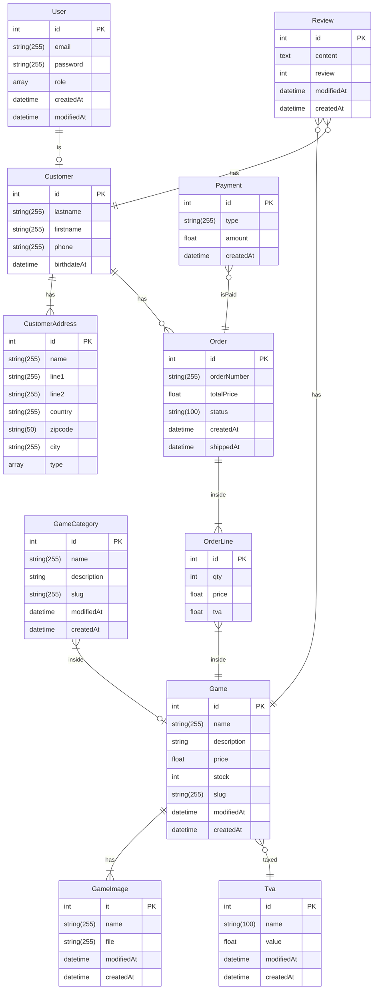

# Diagramme relationnel d'entités



## INSTALLATION

cloner le github

```bash

    # Création de la base de donnée
    php bin/console d:d:c

    # Migrer
    php bin/console d:m:m

    # Générer les fixtures (gérées par Faker pour peupler la base de donnée)
    php bin/console d:f:l

```

## Comment ça marche ?

```html
<h1>CRÉATION D'UN SUBSCRIBER</h1>

<p>
  Nous avons crée un subscriber ./Subscriber/CheckVerifiedUser.php qui a pour
  utilité de venir vérifier lors de la connexion, si l'utilisateur est vérifié
  ou non, on vérifie avec la méthode de notre Entité User isVerified(), nous
  avons pour ça utilisé l'event CheckPassportEvent qui intervient au tout début
  du processus de connexion (<a
    href="https://symfony.com/doc/current/security.html#authentication-events"
    >lien doc symfony </a
  >)
</p>
```
