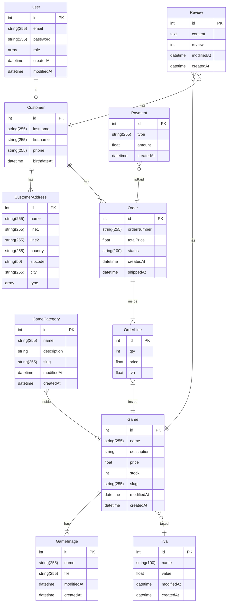

# Diagramme relationnel d'entités



# INSTALLATION

cloner le github

```bash

    # Cloner l'application
    git clone https://github.com/iLynk/sf_ecommerce.git

    # Création de la base de donnée
    php bin/console d:d:c

    # Migrer
    php bin/console d:m:m

    # Générer les fixtures (gérées par Faker pour peupler la base de donnée)
    php bin/console d:f:l

```

## Comment ça marche ?

### L'envoi de mail pour vérifier son compte

```html
<h2>ENVOI D'EMAIL</h2>

<p>
  Pour pouvoir vérifier nos emails, nous avons utilisé une solution locale :
  MailHog afin d'intercepter les mails envoyés depuis notre application. Mais
  comment ça marche derrière ? Eh bien, c'est "tout" simple. Dans notre
  controller, sur la route /register, après avoir enregistré (flush()) le nouvel
  utilisateur en base de données, une méthode
  $this->emailVerifier->sendEmailConfirmation est appelée. Cette méthode prend
  plusieurs paramètres, qui sont au final les éléments utiles à la construction
  de notre mail. Cette méthode provient de notre classe "EmailVerifier", qui
  possède deux méthodes :
</p>
<ol>
  <li>
    La première, sendEmailConfirmation(), qui va, comme son nom l'indique,
    envoyer un mail qu'elle aura construit grâce aux paramètres fournis, à
    l'utilisateur qui vient d'être créé.
  </li>
  <li>
    La deuxième, handleEmailConfirmation(), va récupérer la requête effectuée
    via le lien contenu dans le mail envoyé précédemment, vérifier que tout est
    en ordre pour pouvoir passer la propriété de notre utilisateur "$isVerified"
    à true, permettant ainsi la connexion par la suite.
  </li>
</ol>
```

### La vérification sur l'email vérifié ou non de l'utilisateur

```html
<h2>CRÉATION D'UN SUBSCRIBER</h2>

<p>
  Pour vérifier si l'utilisateur a bien vérifié son email (voir la partie sur
  l'email), nous avons créé un subscriber, qui sera tout simplement un "écouteur
  d'événement" placé en l'occurrence sur l'événement "CheckPassportEvent"
  puisqu'il intervient au tout début du processus de connexion 
  (lien vers la docSymfony : https://symfony.com/doc/current/security.html#authentication-events). 
  Lorsque cet événement est déclenché, la méthode onCheckPassport est lancée et vient
  vérifier si l'utilisateur en train de se connecter possède bien une adresse
  mail vérifiée. Pour cela, on utilise la méthode de notre entité User "isVerified()"
  qui nous retourne la propriété $isVerified, qui passe à true lorsque l'email
  de l'utilisateur est vérifié. Deux suites possibles :
</p>
<ol>
  <li>Oui, l'utilisateur est vérifié, c'est cool, on ne fait rien.</li>
  <li>
    Non, l'utilisateur n'est pas vérifié, c'est moins cool, dans ce cas-là, on
    génère une exception qui vient expliquer que l'utilisateur n'est pas
    vérifié.
  </li>
</ol>
```
